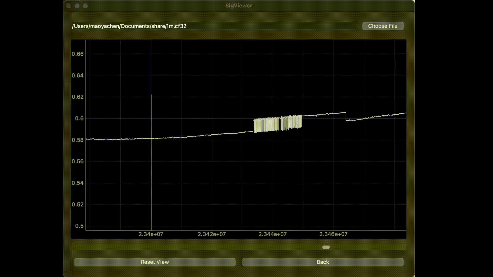

# SigViewer

A Qt-based signal (especially the IQ signal collected from any SDR)
viewing/editing tool. Suitable for large datasets (> 200 Mb).
**Low memory usage and fast speed even with large data volumes**.

> Still working in progress.

**Feel free to contribute!**

